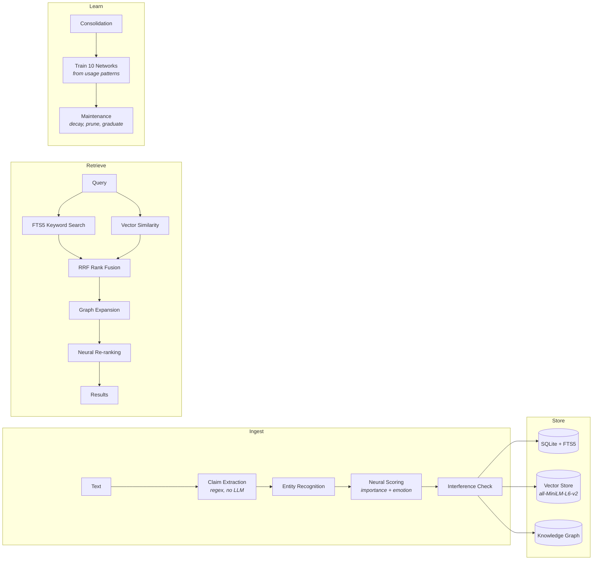
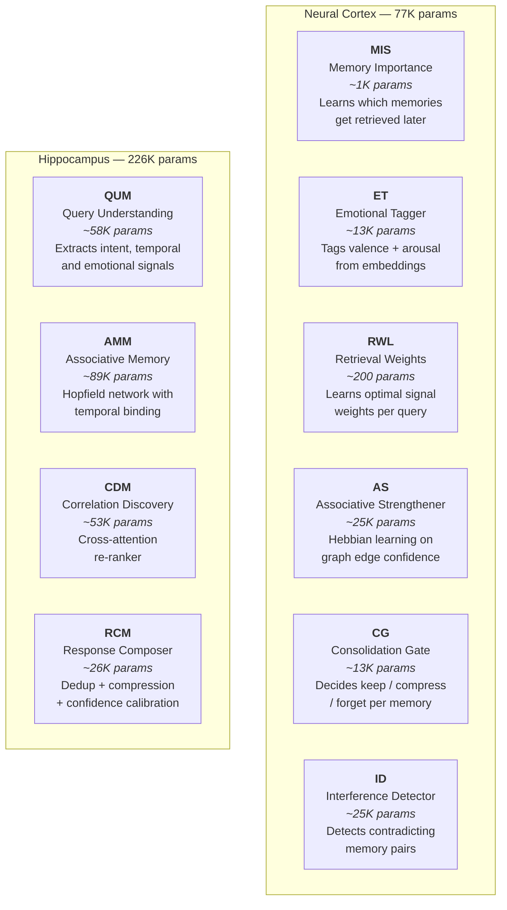

<p align="center">
  <h1 align="center">TITAN</h1>
  <p align="center">Conversational memory for AI agents.<br>Local. Trainable. Zero dependencies.</p>
</p>

<p align="center">
  <a href="https://github.com/gschaidergabriel/titan-memory/blob/main/LICENSE"></a>
  <a href="https://www.python.org/downloads/"></a>
  <a href="https://pytorch.org/"></a>
  
  
</p>

---

Titan is a Python library that gives AI agents long-term memory with retrieval quality that improves over time. It stores memories as claims with confidence levels, retrieves them using keyword + semantic + graph fusion, and trains 10 small neural networks from usage patterns to get better at deciding what matters.

Everything runs locally. No API keys, no external servers, no vector database to manage. SQLite + PyTorch on CPU.

```python
from titan import Titan, TitanConfig

memory = Titan(TitanConfig(data_dir="./memory"))

memory.ingest("Alice is a backend engineer at Google.", origin="user")
memory.ingest("The auth service runs on port 8080.", origin="user")

results = memory.retrieve("Where does Alice work?")
# [{'content': 'Alice is a backend engineer at Google.', 'confidence': 0.8, ...}]

context = memory.get_context_string("Tell me about the auth service")
# "[certain] The auth service runs on port 8080."
```

## How It Works



**Ingestion** extracts claims and entities via regex (no LLM needed), computes embeddings, and scores importance/emotion with two small neural networks. **Storage** writes to three layers: SQLite with FTS5 for keywords, a vector store for semantic search, and a knowledge graph for relationships. **Retrieval** fuses keyword and semantic rankings via Reciprocal Rank Fusion, expands through the graph, and applies learned neural weights. **Consolidation** periodically trains all networks from accumulated access patterns and prunes stale memories.

## What the Neural Networks Actually Do

Titan has 10 small PyTorch networks (~303K parameters total) that run on CPU in <1ms per call. They start with rule-based defaults and gradually take over as they accumulate training data.



**Cold start behavior:** All networks use a 4-phase warmup. Steps 0-50: 100% rule-based. Steps 50-150: 50/50 blend. Steps 150-300: 75% neural. Steps 300+: 95% neural. The system works from step zero and improves with use.

**Training:** Networks train during consolidation cycles (configurable, default every 6 hours). MIS learns from access logs (which memories get retrieved). RWL learns from retrieval feedback (which weight combinations produce useful results). Training runs in <100ms on CPU.

## Benchmarks

> [!NOTE]
> Measured on AMD Ryzen 9 7940HS, 24.4 GB RAM, CPU-only. Titan: 30 items, 20 queries, 3 runs averaged. Mem0: 200 items, 15 queries, local Qwen-3B. Graphiti/Letta could not run without their required infrastructure.

| Metric | **Titan** | Mem0 v1.0.7 | Graphiti v0.28 | Letta v0.16 |
|--------|-----------|-------------|----------------|-------------|
| Precision@1 | **0.900** | 0.733 | needs Neo4j | needs server |
| Precision@5 | **1.000** | 0.867 | " | " |
| MRR | **0.942** | 0.800 | " | " |
| Ingest/item | **28 ms** | 11,837 ms | " | " |
| Retrieval P50 | 14 ms | **11 ms** | " | " |
| RAM | **17 MB** | 93 MB | " | " |
| Neural params | **77,580** | 0 | 0 | 0 |
| Knowledge graph | **Yes** | No | Yes | No |
| FTS keyword search | **Yes** | No | No | No |
| Languages | **8** | 1 | 1 | 1 |
| External deps | **None** | ChromaDB + LLM | Neo4j + LLM | Server + PostgreSQL |

Titan is 430x faster on ingest because it uses regex extraction instead of LLM calls. Retrieval quality is higher because of multi-signal fusion (keywords + semantics + graph) rather than vector-only search. Mem0 is 1.3x faster on retrieval (single vector lookup vs. multi-path fusion). Full methodology and analysis: **[Benchmark Paper](docs/BENCHMARK.md)**.

## Installation

```bash
pip install titan-memory
```

```bash
# Or from source
git clone https://github.com/gschaidergabriel/titan-memory.git
cd titan-memory
pip install -e .
```

> [!TIP]
> Requirements: Python 3.10+, PyTorch 2.0+, sentence-transformers 2.2+. All run on CPU.

## API

### Core

```python
from titan import Titan, TitanConfig

config = TitanConfig(
    data_dir="./memory",          # Where to store everything
    vector_model="all-MiniLM-L6-v2",  # Embedding model
    default_limit=5,              # Results per query
    auto_maintenance=True,        # Hourly decay + pruning
    auto_consolidation=False,     # Set True for automatic neural training
    consolidation_interval_hours=6.0,
)
memory = Titan(config)
```

| Method | Returns | Description |
|--------|---------|-------------|
| `ingest(text, origin, confidence)` | `dict` | Store a memory. Returns claims, entities, topics. |
| `retrieve(query, limit, context)` | `list[dict]` | Retrieve relevant memories. |
| `get_context_string(query, limit)` | `str` | Formatted context block for LLM injection. |
| `forget(node_id)` | `bool` | Remove a memory (if not protected). |
| `protect(node_id)` | `bool` | Protect from automatic pruning. |
| `consolidate()` | `dict` | Trigger neural training + maintenance. |
| `get_stats()` | `dict` | Node, edge, vector, claim counts. |
| `health_check()` | `dict` | System status. |

### Convenience Functions

```python
from titan import remember, recall, get_context, forget, protect

remember("The user prefers dark mode.")        # Global singleton, ~/.titan/data/
results = recall("user preferences")
context = get_context("What does the user like?")
```

### Origin Types

| Origin | Confidence | Use for |
|--------|-----------|---------|
| `user` | 0.8 | Things the user stated directly |
| `code` | 0.95 | Facts from code analysis |
| `observation` | 0.7 | Behavioral observations |
| `inference` | 0.5 | AI-generated conclusions |
| `memory` | 0.6 | Recalled from prior memory |

## Design Decisions

**Claims, not facts.** Every stored item is a claim with a confidence level and origin. Nothing is treated as ground truth. Confidence decays with a 7-day half-life. Old memories fade unless they prove useful (get accessed), in which case they graduate to permanent protection.

**Regex extraction, not LLM.** Ingestion uses pattern matching to extract entities and subject-predicate-object claims. This is less accurate than LLM extraction but 430x faster and requires no external model. The tradeoff is intentional: for agents that ingest continuously, speed matters more than extraction quality.

**Three retrieval signals, not one.** FTS5 keyword search finds exact matches. Vector similarity finds semantic matches. The knowledge graph finds structural relationships. Reciprocal Rank Fusion combines all three rankings. This avoids the failure mode where vector-only search returns semantically similar but factually wrong results.

**10 small networks, not 1 large one.** Each network has a single job (importance scoring, emotion tagging, retrieval weighting, etc.) and trains independently from its own data source. This means each network can reach maturity on different timescales, and a failure in one doesn't affect the others.

## Multilingual Support

FTS stop-word filtering, temporal detection, emotion detection, and negation detection support 8 languages:

| | EN | DE | ES | FR | PT | ZH | HI | AR |
|---|---|---|---|---|---|---|---|---|
| Stop words | ~80 | ~70 | ~55 | ~50 | ~45 | ~45 | ~35 | ~35 |
| Temporal | 25 | 22 | 19 | 16 | 16 | 26 | 26 | 24 |
| Emotion | 27 | 23 | 22 | 22 | 22 | 23 | 21 | 23 |
| Negation | 7 | 8 | 8 | 7 | 7 | 7 | 7 | 8 |

The embedding model (`all-MiniLM-L6-v2`) supports 100+ languages for semantic similarity.

## Framework Integrations

Two universal patterns work with any LLM:

1. **System prompt injection** -- call `memory.get_context_string(query)` before each LLM call and prepend the result to the system message.
2. **Tool-based** -- give the LLM `memory_store` / `memory_recall` tools.

| Framework | Example | Guide |
|-----------|---------|-------|
| Claude API | [`examples/claude_api.py`](examples/claude_api.py) | [Guide](docs/INTEGRATIONS.md#claude-api-anthropic-sdk) |
| Ollama | [`examples/ollama_chat.py`](examples/ollama_chat.py) | [Guide](docs/INTEGRATIONS.md#ollama--python) |
| OpenAI-compatible | [`examples/openai_compatible.py`](examples/openai_compatible.py) | [Guide](docs/INTEGRATIONS.md#openai-compatible-apis) |
| LangChain | [`examples/langchain_memory.py`](examples/langchain_memory.py) | [Guide](docs/INTEGRATIONS.md#langchain) |
| LlamaIndex | -- | [Guide](docs/INTEGRATIONS.md#llamaindex) |
| CrewAI | -- | [Guide](docs/INTEGRATIONS.md#crewai) |
| AutoGen v0.4 | -- | [Guide](docs/INTEGRATIONS.md#autogen-v04) |
| Pydantic AI | -- | [Guide](docs/INTEGRATIONS.md#pydantic-ai) |

Full integration guide with copy-pasteable code: **[docs/INTEGRATIONS.md](docs/INTEGRATIONS.md)**

## Data Storage

```
~/.titan/data/
├── titan.db              # SQLite: nodes, edges, events, claims, FTS5 index
├── titan_vectors.npz     # Compressed embeddings (384-dim per memory)
├── titan_vector_ids.json # Node-to-vector mapping
├── hippocampus.db        # Retrieval training logs
└── models/
    ├── titan_cortex.pt       # Cortex checkpoint (6 networks)
    └── titan_hippocampus.pt  # Hippocampus checkpoint (4 networks)
```

## License

MIT. See [LICENSE](LICENSE).
